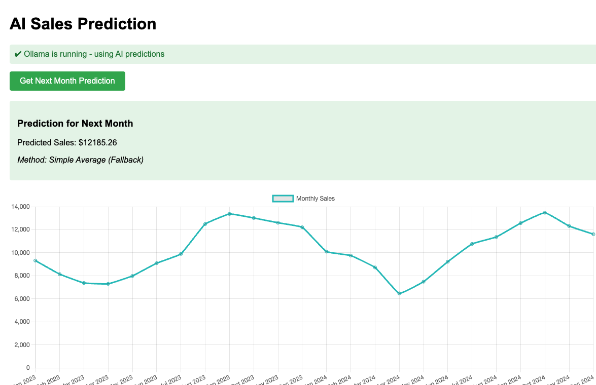
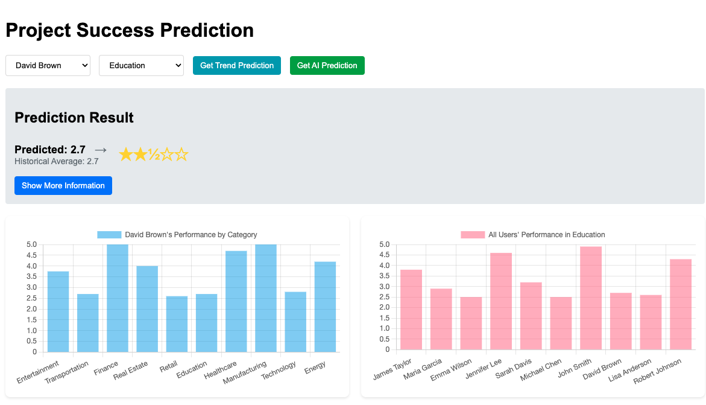
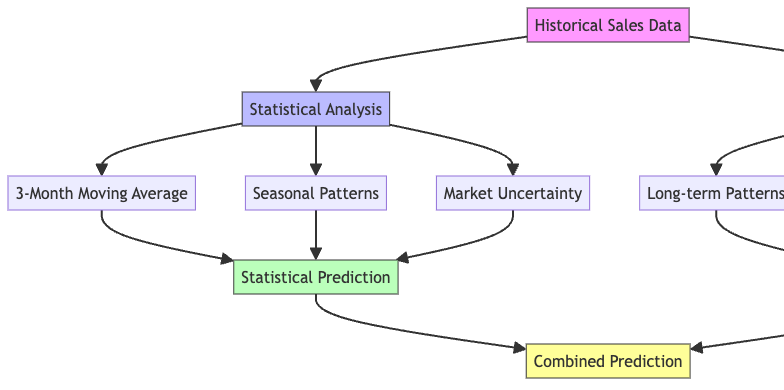
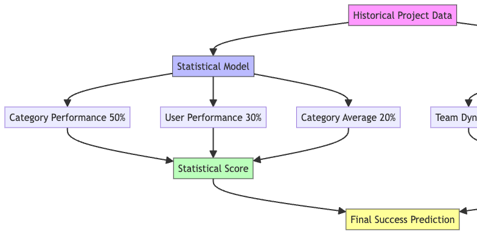

# AI Prediction Platform

A comprehensive prediction platform that combines statistical analysis and AI-powered predictions using Ollama. The platform consists of two main applications:

## 1. Sales Prediction


Predicts future sales values based on historical monthly data using both statistical analysis and AI models.

## 2. Project Success Prediction


Predicts project success rates across different business categories and team members using performance history and AI-driven analysis.

## Features

### Sales Prediction
- Monthly sales forecasting
- Historical trend analysis
- 3-month moving average baseline
- AI-enhanced predictions
- Seasonal pattern recognition

### Project Success Prediction
- Team member performance tracking (1-5 scale)
- Category-specific success rates
- Individual and team trend analysis
- Cross-category performance insights
- Historical performance data analysis

## Technical Stack

- Node.js with Express
- Ollama AI integration (supports Llama 2 and Mistral models)
- Real-time data processing
- RESTful API endpoints

## How It Works

Both applications use a dual-prediction approach combining statistical analysis with AI-powered predictions.

### Sales Prediction Workflow



The sales prediction system processes historical sales data through two parallel paths:
1. **Statistical Model** (left branch):
   - Calculates 3-month moving averages for baseline predictions
   - Identifies and applies seasonal adjustments
   - Adds controlled random variation to account for market uncertainty

2. **AI Model** (right branch):
   - Analyzes long-term sales patterns and trends
   - Evaluates market trends and seasonal factors
   - Generates sophisticated sales forecasts

The final prediction combines insights from both models for optimal accuracy.

### Project Success Prediction Workflow



The project success prediction system evaluates team and project data through:
1. **Statistical Model** (left branch):
   - Weighs category-specific performance (50%)
   - Factors in overall user performance (30%)
   - Incorporates category averages (20%)
   - Uses linear regression for trend analysis

2. **AI Model** (right branch):
   - Evaluates team dynamics and collaboration patterns
   - Analyzes cross-category performance indicators
   - Processes historical success patterns
   - Considers project complexity and team expertise

Both models' outputs are combined to generate the final success prediction score.

## API Endpoints

### Common Endpoints
- `/api/status`: Check Ollama service status

### Sales Prediction
- `/api/sales/predict`: Get sales predictions
- `/api/sales/data`: Access historical sales data

### Project Success Prediction
- `/api/project/predict`: Get project success predictions
- `/api/project/data`: Access historical project data
- `/api/project/categories`: List available project categories

## Setup

1. Install dependencies:
   ```bash
   npm install
   ```

2. Ensure Ollama is running locally (port 11434)

3. Start the server:
   ```bash
   npm start
   ```

The application will be available at `http://localhost:3000`

## Data Structure

The platform uses two main data files:

### Sales Data (`data.json`)
```json
{
    "month": "Jan 2024",
    "value": 10101.81
}
```

### Project Data (`project-data.json`)
```json
{
    "user": "John Smith",
    "category": "Technology",
    "ranking": 4.5,
    "date": "2024-03-06"
}
```

## Scripts

- `npm start`: Start the application server
- `npm run generate-data`: Generate sample data for testing

## Requirements

- Node.js
- Ollama running locally
- Express.js
- node-fetch

## Performance Scale

Predictions are made on a 1-5 scale where:
1 = Needs Improvement
5 = Excellent Performance
